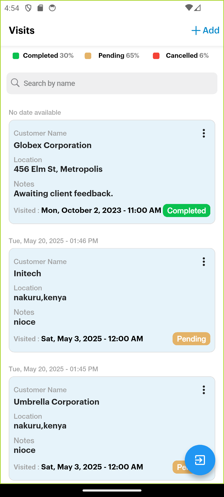
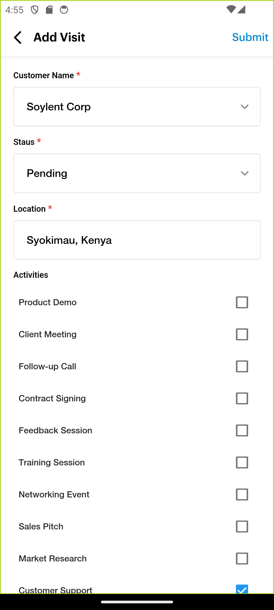
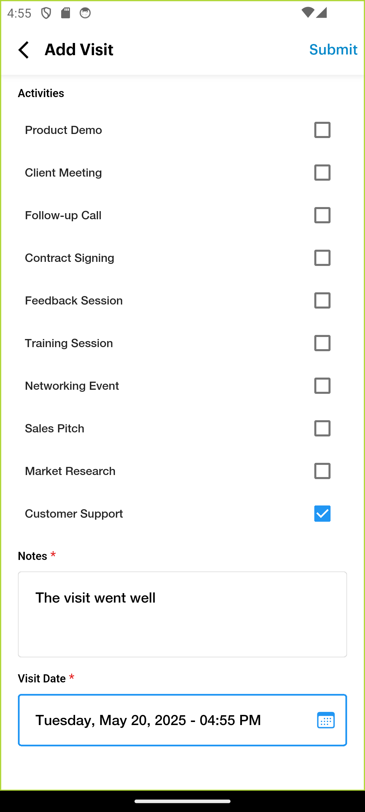
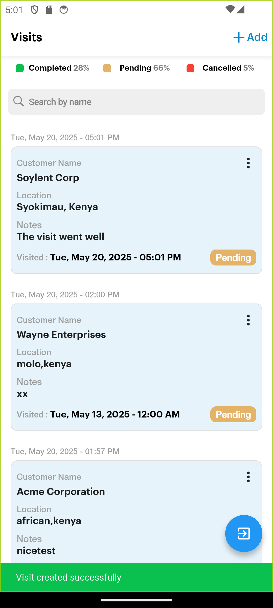
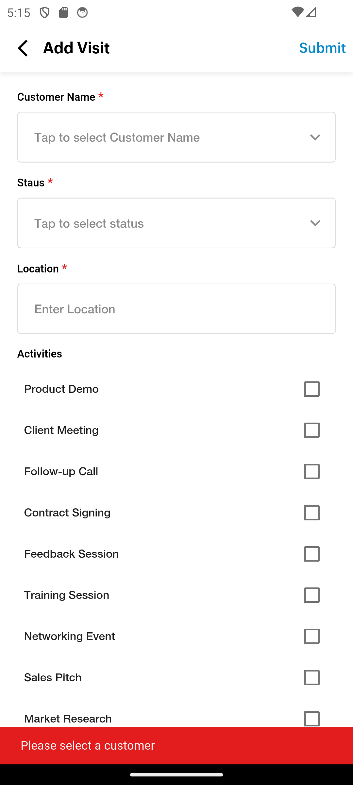
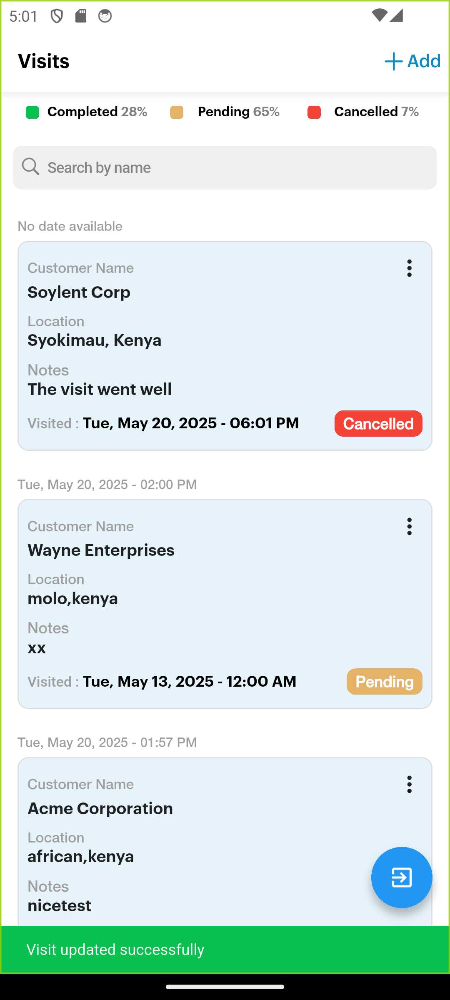

# Rtm

![coverage][coverage_badge]
[![style: very good analysis][very_good_analysis_badge]][very_good_analysis_link]
[![License: MIT][license_badge]][license_link]

Generated by the [Very Good CLI][very_good_cli_link] 🤖

A Route To Market Sales Force Automation app

---
## Overiview
The application is built to simulate the Visit tracking operation with the following capabilities
- View a list of visits
- Search by customer name on the list of visits
- Create/Update a visit
- Data validation is handled within the application
- Network request and response relayed to the end user
## Sample screenshots
| List of visits                               | Add a new visit                              | Add a new vist                                       |
| -------------------------------------------- | -------------------------------------------- | -------------------------------------------- |
|  |  |  |

| Succcess                                     | Validation                                   | Update                                        |
| -------------------------------------------- | -------------------------------------------- | -------------------------------------------- |
|  |  |  |

## Architectural choices 
### State Management and Navigation
- Bloc/cubit - Simplicity and ease of use to handle global state
- ValueNotifiers - handles local state
- Hive databases to handle App state and data interactions between components 
- GoRouter - handles the scalability of the project in the near future
  
### Clean architecture
- Handles separations of concern to allow for the growth of the project and make it easy to delve into for any new individual
- Clear data and API layers to allow for testing

## Running App 🚀

This project contains 3 flavors:

- development
- staging
- production

To run the desired flavor either use the launch configuration in VSCode/Android Studio or use the following commands:

```sh
# Get dependencies
$ flutter pub get

# Code generation 
dart run build_runner build --delete-conflicting-outputs

# Development
$ flutter run --flavor development --target lib/main_development.dart

# Staging
$ flutter run --flavor staging --target lib/main_staging.dart

# Production
$ flutter run --flavor production --target lib/main_production.dart
```

_\*Rtm works on iOS, Android, Web, and Windows._

---
## Offline support
- I had a foundation of a local database using Hive that would suit offline functionality
  
### Procedure
- Add a local state of the data when creating a new visit and handle submission of data via Cubits
- It would blend into the already submitted, but with a clear visual difference, such as color, to indicate offline
- Once back online, a network call will be made via the first page opening to allow submission
- The reasons, such as id, will then be updated with the local copy
  
## CLI
- I set up GitHub workflows that would generate APKs whenever a PR is created, such as
  -  Development APK
  -  Production APK
  -  Staging APK
- Uploaded all the GitHub secrets, such as: 
  - RELEASE_KEYSTORE
  - RELEASE_KEYSTORE_PASSPHRASE
  - RELEASE_KEYSTORE_PASSPHRASE
  - RELEASE_KEYSTORE_ALIAS


[coverage_badge]: coverage_badge.svg
[flutter_localizations_link]: https://api.flutter.dev/flutter/flutter_localizations/flutter_localizations-library.html
[internationalization_link]: https://flutter.dev/docs/development/accessibility-and-localization/internationalization
[license_badge]: https://img.shields.io/badge/license-MIT-blue.svg
[license_link]: https://opensource.org/licenses/MIT
[very_good_analysis_badge]: https://img.shields.io/badge/style-very_good_analysis-B22C89.svg
[very_good_analysis_link]: https://pub.dev/packages/very_good_analysis
[very_good_cli_link]: https://github.com/VeryGoodOpenSource/very_good_cli
